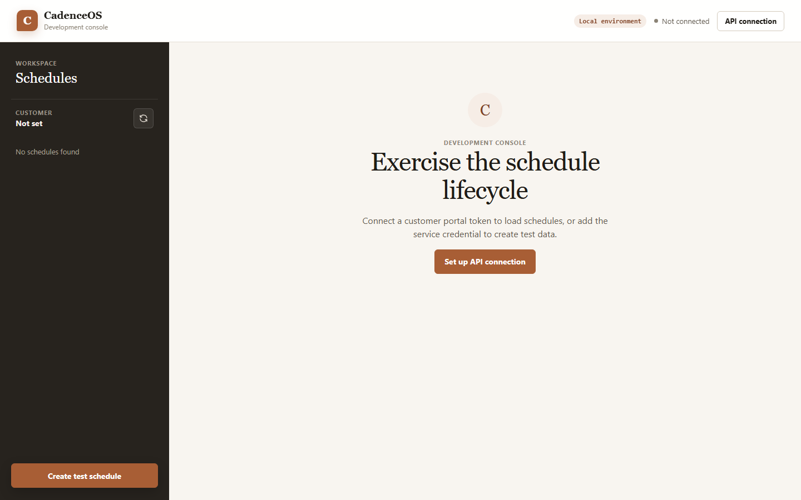

# CadenceOS

A standalone scheduling service that turns one-time WooCommerce purchases into
recurring orders on a customer-controlled cadence, with pause, skip, defer, and
cadence-change built in.



**Status:** early development. Spec Phase 1 (core scheduling) is in progress; no
orders are placed yet. Full technical spec:
[`docs/replenishment-service-spec.md`](docs/replenishment-service-spec.md).

CadenceOS is deliberately **not** a WooCommerce Subscriptions configuration. The
service owns schedules; WooCommerce owns catalog, checkout, payment, and fulfillment.
That split is what lets the same service deploy behind a second brand as a
configuration change rather than a rewrite.

---

## Compliance boundary

The service stores `interval_days` and nothing that implies consumption — no usage
rates, doses remaining, supply projections, adherence tracking, intake logs, or
per-compound cadence recommendations.

Copy rule on every surface: **"when to reorder," never "when to take."**

This is a hard constraint, and it is enforced mechanically: `internal/compliance`
fails the build if a forbidden identifier appears in a migration, model, or DTO. The
reasoning is in [`docs/replenishment-service-spec.md`](docs/replenishment-service-spec.md) §2
and the rule is restated in [`CLAUDE.md`](CLAUDE.md).

---

## Stack

Go (toolchain pinned in `go.mod`), PostgreSQL 16, `goose` (migrations), `pgx` (data
access), Postmark (transactional email). Deployed on Hetzner via Coolify.

Two further choices are recorded but **not yet adopted in the build**, and the
distinction is worth keeping straight when reading the code:

- **`river`** for the durable queue ([ADR 0002](docs/adr/0002-river-for-durable-queue.md)).
  Phase 1 runs the materializer synchronously and needs no queue. The `Queue` interface
  in `internal/materialize` is the seam that makes wiring it in an adapter change
  rather than a rewrite — it has no implementation yet, on purpose.
- **`sqlc`** for typed query code ([ADR 0003](docs/adr/0003-goose-migrations-sqlc-pgx.md)).
  Queries in `internal/store` are hand-written SQL over `pgx` today.

Both ADRs are marked *provisional* for the same reason: the spec (§4) directs reuse of
whatever PartnerOS settled on, and that codebase was not reachable when they were
written.

Decision records: [`docs/adr/`](docs/adr/).

## Local development

```sh
make deps      # install tool dependencies
cp .env.example .env
# then edit .env: set PORTAL_JWT_SECRET and SERVICE_API_KEY, e.g. via
#   openssl rand -base64 48
# the service refuses to start without both (see .env.example for why)
set -a; . ./.env; set +a
make db-up     # start local Postgres 16
make migrate   # apply migrations
make run       # start the service on :8080
```

Open `http://localhost:8080/console/` for the dependency-free development console.
It exercises schedule creation, customer list/detail reads, every lifecycle action,
and the occurrence timeline against the same API used by WooCommerce. Enter a portal
JWT and its customer ID under **API connection**; add the service key when testing
schedule creation. Credentials are kept in browser session storage and are cleared
when that browser tab is closed.

```sh
make lint      # gofmt, go vet, staticcheck
make test      # go test -race ./... (requires a running database)
make build     # go build ./...
make security  # dependency vulnerability audit
```

`make test` requires the local database. `make db-up` starts one via Docker Compose.

## Layout

See the Layout section of [`CLAUDE.md`](CLAUDE.md).

---

## Delivery lifecycle

Every change goes: issue → feature branch → pull request → automated checks → AI
security review → peer approval → staging → business approval → production.

- How to contribute: [`CONTRIBUTING.md`](CONTRIBUTING.md)
- Gate-by-gate detail: [`docs/LIFECYCLE.md`](docs/LIFECYCLE.md)
- Workflow inputs and permissions: [`docs/WORKFLOWS.md`](docs/WORKFLOWS.md)
- Release records: [`docs/RELEASE_METADATA.md`](docs/RELEASE_METADATA.md)
- Reporting a vulnerability: [`SECURITY.md`](SECURITY.md)

### Pipeline design constraints

Inherited from the Project Helix template and kept deliberately:

- **No third-party GitHub Actions.** Only `actions/checkout`, published by GitHub, is
  used, pinned to a full commit SHA rather than a movable tag. Useful third-party
  actions are documented as recommendations in
  [`docs/RECOMMENDED_ACTIONS.md`](docs/RECOMMENDED_ACTIONS.md), not installed. The Go
  toolchain comes from the runner image plus the `toolchain` directive in `go.mod`, so
  no `setup-*` action is needed.
- **Least-privilege permissions.** Every reusable workflow sets `permissions: {}` at
  the top level and grants the narrowest scope per job.
- **No false green.** A check that cannot really run fails rather than exiting `0`. A
  placeholder that exited `0` would report a green check for a test suite that never
  ran, and nobody investigates a green check.
- **Immutable commit SHA.** An approval always refers to the exact commit reviewed.

### Current state of the gates

| Gate | State |
| --- | --- |
| `lint` / `test` / `build` / `security-check` | Real commands against the Go stack |
| Health checks | Functional — probe asserts on the deployed commit SHA |
| Deploy steps | Real — they post the Coolify webhook. **Never yet run:** see below |
| Rollback | **Manual, no workflow.** See below |
| Peer approval (`CODEOWNERS`) | **Not operational.** See below |
| Required status checks | **Not configured.** See below |

Four gates are incomplete, and each is a decision rather than an oversight:

- **The deploy steps are real, but nothing has been deployed yet.**
  `staging-deploy.yml` and `production-deploy.yml` post the Coolify deploy webhook;
  the SHA-validation and approval-match guards around them are functional and must be
  kept. What is still missing is outside this repository: the `staging` and
  `production` GitHub Environments, their secrets, and the Coolify application
  configuration — including `BUILD_SHA`, without which a successful deploy still fails
  the health check. Tracked in
  [issue #40](https://github.com/EPW80/replenishment-system/issues/40); the checklist
  is in [`docs/DEPLOYMENT.md`](docs/DEPLOYMENT.md).
- **There is no rollback workflow; recovery is manual.** `rollback.yml` was a stub and
  was deleted rather than wired up, because the deploy webhook takes no commit SHA — it
  builds whatever the tracked branch points at, so firing it for a rollback would
  rebuild the broken release and report success. A workflow that pretends to roll back
  is worse than none, because people plan around it. Deploying a per-commit registry
  image tag is what would make this automatable. See
  [`docs/LIFECYCLE.md` §12](docs/LIFECYCLE.md#12-rollback).
- **`CODEOWNERS.example` has not been renamed to `.github/CODEOWNERS`.** GitHub
  silently ignores rules naming a team without write access, which would produce a
  peer-approval gate that appears configured and enforces nothing. See
  [`docs/CUSTOMIZATION.md`](docs/CUSTOMIZATION.md) step 2.
- **Required status checks are not set in branch protection.** The check names must be
  read off a real run rather than predicted — a required check whose name matches
  nothing is silently never enforced. See
  [`docs/LIFECYCLE.md`](docs/LIFECYCLE.md#required-status-checks--deferred).

Until the repository settings in
[`docs/LIFECYCLE.md`](docs/LIFECYCLE.md#configuration-checklist) are applied, the
lifecycle gates are advisory.
